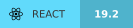
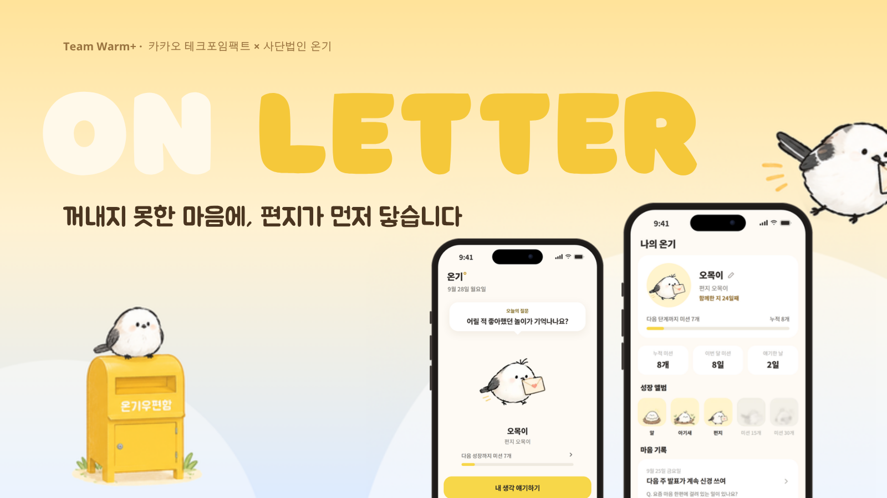

# 2026-2-OSSProj-Warmplus-05

동국대학교 2026년 2학기 오픈소스소프트웨어프로젝트 5팀 Warm+ 레포지토리입니다.

## 👋 팀원 소개

| 이름 | 전공 | 역할 |
|---|---|---|
| 조수아 (팀장) | 통계학과 (SWAI 연계전공) | 기획 · 디자인 · 콘텐츠 |
| 전동현 | 통계학과 (SWAI 연계전공) | 프론트엔드 · 서버 |
| 박현준 | 통계학과 (SWAI 연계전공) | 리서치 · 데이터 분석 · 안전 검증 |

## 📁 폴더 구성

- `src/`: 팀 프로젝트의 오픈소스 소프트웨어 (On Letter 웹앱, Next.js)
- `Doc/`: 수행계획서 · 발표자료 · 회의록 등 제출 문서

---

## 🛠️ Tech

### Frontend




### Server · AI


### Auth · DB


### Test


### Deploy


### Collaboration


---

## 1. 프로젝트 명



**On Letter (먼저 도착한 편지)**: 도움을 요청하기 전의 청년에게, 실제 손편지를 먼저 건네는 마음 돌봄 웹앱

협력 기관: 사단법인 온기 (카카오 테크포임팩트)

## 2. 프로젝트 소개

> 마음이 힘든 청년은 늘었지만, 상담 신청이나 고민 작성까지 가는 첫걸음은 여전히 무겁다. 온기우편함도 고민을 먼저 써야 시작되고, 손편지 답장까지 3~4주가 걸린다. On Letter는 순서를 바꿔, 비슷한 고민에 도착했던 실제 손편지를 먼저 읽게 하고 마음이 준비되면 온기우편함으로 연결한다.

## 3. 주요 기능 (계획)

- 쓰지 않고 고르는 3분 마음 질문 → 비슷한 고민의 온기레터 추천
- 오목이와 함께하는 오늘의 질문 · 1일 1미션, 미션에 따라 자라는 캐릭터
- 위기 표현이 감지되면 AI 답장 대신 24시간 도움 기관 안내
- 마음이 준비되면 온기우편함 고민편지로 연결

## 4. 온기 웹앱 실행 방법

### 더블클릭으로 실행
- **Mac**: `src/온기실행_Mac.command` 더블클릭 → 터미널 창이 열리고, 준비되면 브라우저가 자동으로 열려요.
  - "확인되지 않은 개발자" 경고로 열리지 않으면 파일을 **우클릭(또는 control+클릭) → 열기**를 한 번 해 주세요. 다음부터는 더블클릭으로 열려요.
- **Windows**: `src/온기실행_Windows.bat` 더블클릭
  - "Windows의 PC 보호" 창이 뜨면 **추가 정보 → 실행**을 눌러 주세요.
- 3000번 포트를 다른 프로그램이 쓰고 있으면 3001, 3002… 중 비어 있는 포트로 열려요.
- 처음 한 번은 필요한 파일을 설치해요(1~2분). [Node.js](https://nodejs.org) LTS가 설치되어 있어야 해요.
- 끄려면 열린 창에서 `Ctrl+C`를 누르거나 창을 닫으세요.

### 터미널에서 실행

```bash
cd src              # 웹앱 폴더로 이동
npm install          # 의존성 설치 (Node 20.9 이상, 권장 24)
npm run dev          # 개발 서버 → http://localhost:3000 (휴대폰 화면 크기로 보면 좋아요)
npm test             # 단위·컴포넌트 테스트 (Vitest)
npm run build        # 프로덕션 빌드
npm run sync:letters # 스티비에서 온기레터 목록을 다시 받아 data/letters.json 갱신
```

- 대화 기능은 기본적으로 목업 응답으로 동작해요. Claude 연동 방법은 `src/.env.example`을 참고하세요.
- 시연 모드: 주소 뒤에 `?demo=1`을 붙이면 미션 추가·단계 변경·날짜 이동 조작판이 나타나요.
- 설계 문서: `src/docs/specs/2026-09-26-ongi-webapp-design.md`
- 구현 계획: `src/docs/plans/2026-09-26-ongi-webapp-v1.md`
