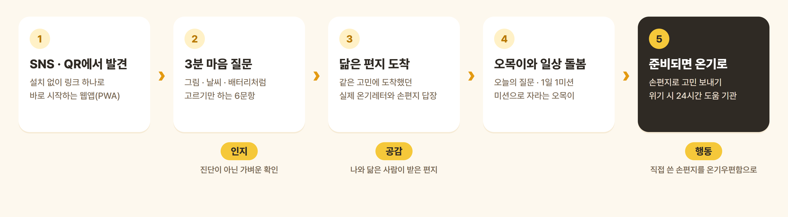
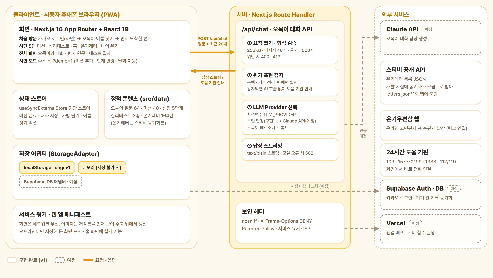
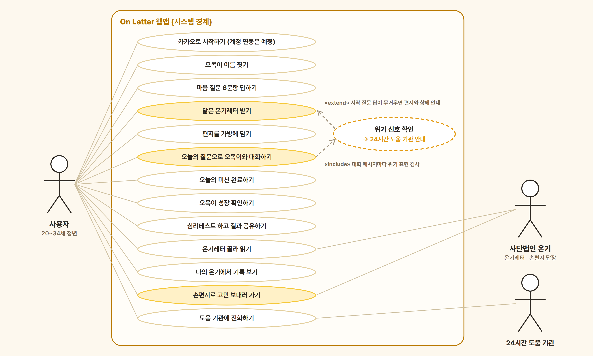
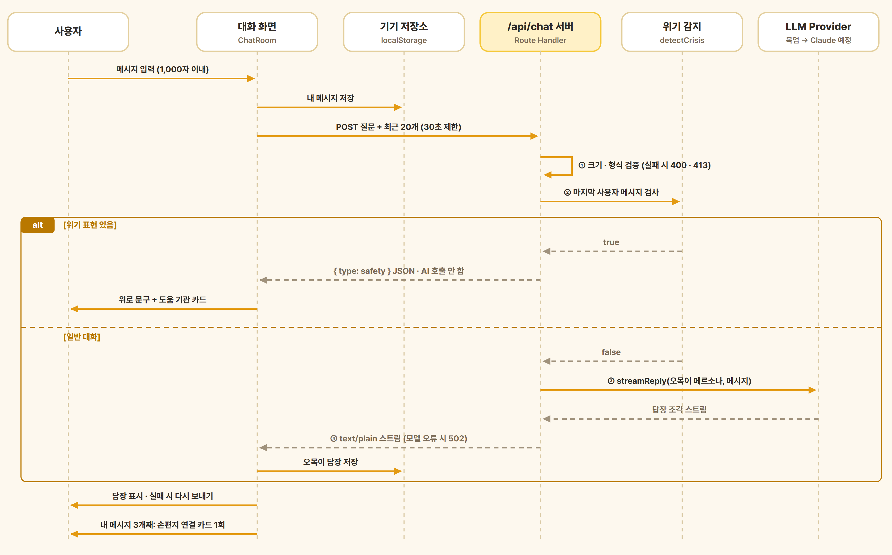
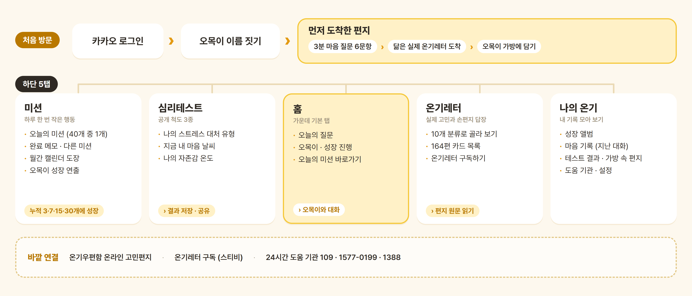
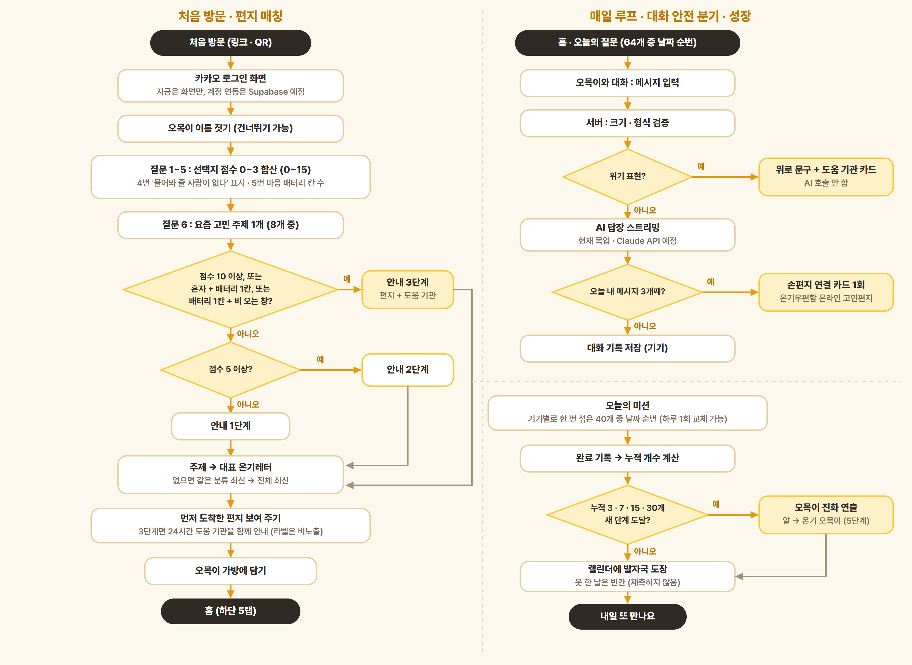
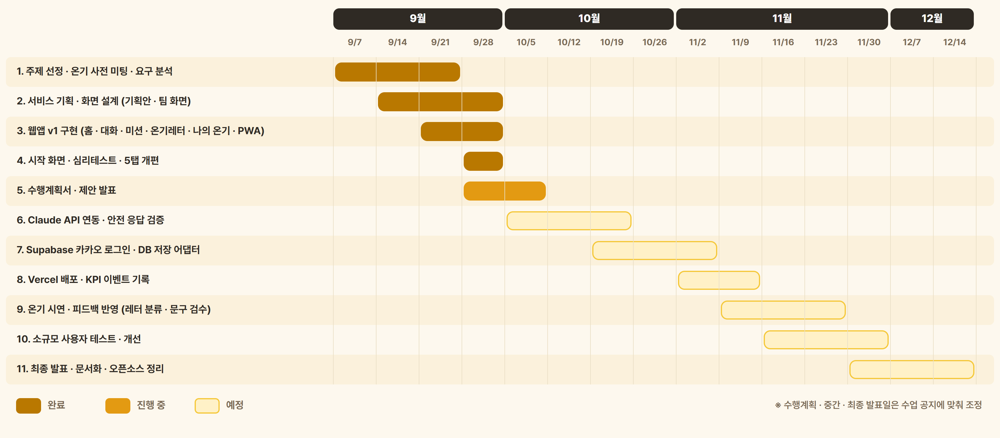

# A1.1 OSS 프로젝트 수행계획서

## 1. 프로젝트 수행팀 개요

* 수행 학기: 2026학년도 2학기 (오픈소스소프트웨어프로젝트)
* 프로젝트명: On Letter (먼저 도착한 편지): 도움을 요청하기 전의 청년에게 실제 손편지를 먼저 건네는 마음 돌봄 웹앱
* 팀명: Warm+ (웜플러스, 5팀)

구분 | 성명 | 학번 | 소속학과 | 연계전공 | 이메일
------|-------|-------|-------|-------|-------
팀장 | 조수아 |  | 통계학과 | SWAI | 
팀원 | 박현준 |  | 통계학과 | SWAI | 
팀원 | 전동현 |  | 통계학과 | SWAI | 

* 지도교수: (소속)      (성명)      
* 협력 기관: 사단법인 온기 (카카오 테크포임팩트 사회혁신가 연계)

## 2. 프로젝트 수행계획  

### 2.1 프로젝트 개요

**주제.** 사단법인 온기는 익명으로 고민을 보내면 자원봉사자(온기우체부)가 손편지로 답장을 전하는 비영리단체다("단 한 사람도 외롭지 않도록, 가장 따뜻한 편지를 보냅니다"). 본 프로젝트는 온기가 이미 가진 자산인 **실제 고민 편지와 손편지 답장(온기레터)** 을 활용해, 아직 도움을 요청하지 않은 청년에게 **편지가 먼저 도착하는 경험**을 주고, 매일의 작은 돌봄을 거쳐 **실제 손편지 행동(온기우편함)** 으로 이어 주는 모바일 웹앱 **On Letter** 를 개발한다.

**선정 배경.** 지난 1년간 정신건강 문제를 경험한 국민은 73.6%로 늘었지만(2022년 63.9%), 정신건강 서비스 이용 방법을 아는 비율은 24.9%로 오히려 줄었다(2022년 27.9%)[1]. 힘든 마음은 많지만 도움을 찾는 행동까지 이어지기는 어렵다. 온기우편함도 "고민을 직접 써서 보내야 시작되고, 답장은 3\~4주 뒤에 도착하는" 구조라, 마음이 지친 사람에게는 첫 행동이 무겁다.

**필요성.** 온기 손편지, 상담 앱, 정신건강복지센터·109 같은 도움 체계는 이미 있다. 그러나 모두 **도움을 찾기로 마음먹은 뒤**에 작동한다. 비어 있는 구간은 "요즘 좀 지친다" 정도의 **도움을 요청하기 전의 마음**이다. On Letter는 이 구간에 놓이는 첫 번째 그물망을 목표로 한다.

**해결 방향.** 순서를 바꾼다. 지금은 "고민을 먼저 쓰고 → 답장을 기다리는" 구조라면, On Letter는 "**편지를 먼저 받고 → 준비되면 고민을 쓰는**" 구조다.

1. SNS·QR 링크로 설치 없이 들어와
2. 그림·날씨·배터리처럼 **고르기만 하는 3분 마음 질문 6문항**에 답하면
3. 같은 고민에 도착했던 **실제 온기레터와 손편지 답장**이 먼저 도착하고
4. 흰머리오목눈이 캐릭터 **오목이**와 오늘의 질문·1일 1미션으로 매일 작은 돌봄을 이어 가다가
5. 준비되면 **온기우편함에 직접 손편지를 보내고**, 위기 신호가 보이면 **24시간 도움 기관**으로 바로 연결한다.

**목적과 최종 결과물.** 상담을 대신하지 않고, 손편지까지 가는 마음의 문턱을 낮추는 것이 목적이다(인지 → 공감 → 행동). 최종 목표는 앱 체류 시간이 아니라 **실제 손편지를 보내는 행동**이다. 최종 설계 결과물은 휴대폰 브라우저에서 바로 실행되고 홈 화면에 설치할 수 있는 **오픈소스 모바일 웹앱(PWA)** 이며, 2026년 9월 말 기준 시연 가능한 v1을 완성했고, 학기 말까지 AI 대화 연동·카카오 로그인·배포·소규모 파일럿까지 진행한다.



그림 1. On Letter 서비스 흐름과 목표 단계(인지 · 공감 · 행동)

### 2.2 추진 배경(자료조사 및 요구분석)  

#### (1) 개발 배경 및 필요성  

**사용자 상황.** 주요 사용자는 **20\~34세 청년**이다. 친구의 "요즘 어때?"에 "괜찮은 척 웃고 넘기는" 사람들, 힘들다는 것을 느끼지만 상담을 신청하거나 고민을 글로 쓰는 단계까지는 가지 않은 사람들이다. 심리정서적 어려움을 겪는 청년이 전문적 도움을 찾아가기까지 여러 과정을 거친다는 점은 선행 질적 연구에서도 다뤄졌다[26].

* 지난 1년 정신건강 문제 경험 73.6%, 정신건강 서비스 이용 방법 인지 24.9%(보건복지부·국립정신건강센터, 2024 국민 정신건강 지식 및 태도 조사, 전국 15\~69세 3,000명)[1]
* 연령별로는 30대의 정신건강 문제 경험률이 79.9%로 높았고, 특히 30대 여성은 87.3%였다(진단율이 아닌 경험률)[2].
* 2024 소셜미디어 이용자 조사에서 20대의 인스타그램 이용률은 80.9%(30대 70.7%)로, 2030 세대에서 이용률 3위 서비스였다[25]. 유입 경로를 인스타그램 중심의 SNS·QR로 설계한 근거로 삼는다.

**협력 기관(온기) 상황.**

* 온기우편함(오프라인 우편함·온라인 고민편지)으로 고민 편지를 받고 온기우체부가 손편지로 답장한다[16]. 전국 우편함은 116곳, 온기우체부는 약 1,000명이며, 2025년 한 해 답장은 약 3만 5천 통, 2017년부터 보낸 답장은 7만 2,485통이다. 편지의 70% 이상이 20\~30대에게서 온다[27].
* 공개 동의를 받은 편지와 답장은 뉴스레터 **온기레터**로 발행되며, 공개 아카이브에 **164편**(2022년 7월 \~ 2026년 8월)이 있다[17].
* 한계: 고민을 **먼저 써야** 시작되고, 답장까지 **3\~4주**가 걸리며, 온라인에서 온기를 처음 접할 접점이 적다.

**자체 자료 분석(온기레터 164편).** 팀이 164편을 제목·미리보기(모호하면 본문 앞부분)로 직접 분류한 결과는 다음과 같다. 진로와 자존감, 불안·지침이 가장 많아, 시작 화면의 고민 주제 8개와 편지 매칭 분류의 근거로 사용했다.

분류 | 편수 | 분류 | 편수
------|------|------|------
진로·꿈 | 27 | 외로움·그리움 | 13
나·자존감 | 27 | 친구·관계 | 13
불안·지침 | 20 | 직장·일 | 11
연애·사랑 | 19 | 가족 | 11
일상·행복 | 14 | 온기 소식 | 9

**요구분석.** 사용자가 도움 앞에서 멈추는 이유를 요구사항으로 바꾸고, 요구사항마다 기능으로 답했다.

사용자의 니즈 | 요구사항 | 구현 기능
------|------|------
고민을 글로 쓰는 것이 부담된다 | 쓰지 않고 골라서 시작 | 그림·날씨·배터리로 고르는 마음 질문 6문항
답장까지 3\~4주를 기다려야 한다 | 기다리지 않고 바로 공감 경험 | 고른 고민 주제와 닮은 실제 온기레터가 바로 도착(8개 주제)
한 번 쓰고 나면 다시 올 이유가 없다 | 매일 가볍게 돌아올 장치 | 오늘의 질문 64개, 1일 1미션 40개, 오목이 5단계 성장
내 마음을 알고 싶지만 진단은 부담된다 | 진단이 아닌 가벼운 자기 이해 | 공개 척도 기반 심리테스트 3종, 결과 저장·공유
위기의 순간에 혼자 남으면 안 된다 | 위험 신호가 보이면 즉시 전문기관 연결 | 대화 위기 표현 감지 시 AI 답장 대신 109·1577-0199 안내, 시작 질문 답이 무거우면 편지와 도움 기관을 함께 안내
준비되면 사람의 위로로 가고 싶다 | 온기 손편지로 가는 출구 | 대화 3번째 메시지에 손편지 연결 카드, 오목이 가방 속 편지, 온기우편함 링크

비기능 요구사항은 다음과 같다.

* 개인정보 최소 수집: v1은 기록을 서버가 아닌 사용자 기기에만 저장하고, 대화 중 개인정보를 묻지 않는다.
* 모바일 우선·접근성: 터치 영역 44px 이상, 노란 글씨 금지(대비), 동작 줄이기(`prefers-reduced-motion`) 대응
* 오프라인 대응: PWA 서비스 워커로 저장해 둔 화면 표시
* 온기의 가치 보존: 사람이 쓴 손편지가 온기의 핵심이므로, AI가 위로 문장을 대신 만들지 않도록 역할을 짧은 공감과 질문으로 제한한다.

#### (2) 선행기술 및 사례 분석  

**관련 동향.**

* 디지털 멘탈케어 앱은 상담 연결(마인드카페), 앱 안 자가 관리(트로스트), 캐릭터 기반 self-care(Finch)로 나뉘어 성장하고 있다[18][19][20].
* 게임화는 참여를 끌어올리는 장치로 널리 쓰이지만, 우울 대상 정신건강 앱 38개 연구(8,110명)의 메타분석에서 **게임화 요소 자체가 효과나 지속률을 유의하게 높이지는 않았다**[4]. 따라서 오목이 성장은 치료 효과로 주장하지 않고 재방문율·온기 전환율로만 검증한다.
* 정신건강 앱은 설치 후 **대부분 2주 안에 이탈**한다[5]. 초반(미션 3·7개)에 성장 보상을 촘촘하게 배치한 근거다.
* 행동활성화 중심의 30일 과제 앱(HeadGear)을 쓴 비임상 직장인 집단(2,271명)에서 12개월 우울 발생이 3.5%로 대조군 8.0%보다 낮았다[3]. **미션 30개(약 30일)를 완성 단계로 둔 근거**다. 다만 습관 형성에는 중앙값 59\~66일이 걸리므로[6] "30일이면 습관이 완성된다"는 표현은 쓰지 않는다. 1주일의 작은 긍정 실천 효과가 6개월까지 유지된 연구[7]는 7개 단계의 근거로 삼았다.
* LLM 챗봇의 정신건강 활용이 늘면서 위기 표현을 놓치거나 부적절하게 응답하는 문제가 제기되고 있다. 본 프로젝트는 **모델을 부르기 전에 서버에서 위기 표현을 먼저 걸러** AI 답장 대신 도움 기관을 안내한다.

**기존 유사 서비스 비교.** 비교 축은 기능의 유무가 아니라 "마음이 힘든 사람에게 최종적으로 요구하는 행동"이다.

서비스 | 최종적으로 요구하는 행동 | 특징 | 한계(본 프로젝트 관점)
------|------|------|------
온기우편함 | 고민을 직접 써서 보냄 | 사람의 손편지 위로 | 쓰기부터 시작, 답장까지 3\~4주
마인드카페 | 전문가 상담 이용 | 전문 심리케어, 상담 연결 | 도움을 찾기로 마음먹은 뒤에 작동
트로스트 | 앱 안에서 마음 관리 | 디지털 멘탈케어 콘텐츠 | 종착점이 앱 안
Finch | 일상 self-care 반복 | 가상의 새를 키우는 습관·참여 | 사람과의 연결로 이어지지 않음
**On Letter** | **가볍게 시작해 실제 손편지로** | 오목이 + 실제 온기 편지 + 미션 | 도움 요청의 가교(상담 대체 아님)

**참고 연구와 설계 반영.**

연구 | 핵심 내용 | 설계 반영
------|------|------
Finch(UX 선행 사례)[18] | 가상의 새를 키우며 작은 목표를 반복 | 미션 누적으로 자라는 오목이 5단계
Six et al.(2021)[4] | 게임화 요소 자체의 추가 효과는 유의하지 않음 | 성장을 치료 효과로 주장하지 않음, KPI로 검증
Baumel et al.(2019)[5] | 정신건강 앱 사용자 대부분 2주 안 이탈 | 3·7개 미션에 초반 성장 보상
Deady et al.(2022)[3] | 30일 행동활성화 앱, 12개월 우울 발생 감소 | 미션 30개에 최종 단계(온기 오목이)
Singh et al.(2024)[6] | 습관 형성 중앙값 59\~66일 | "30일 습관 완성" 표현 금지
Brief COPE[8] · WHO-5[9][11] · 로젠버그 자존감 척도[10] | 공개·검증된 척도 | 심리테스트 3종을 라이선스 조건에 맞춰 우리말로 옮김

**관련 특허 조사(Google Patents 1차 조사).**

특허 | 권리자 · 상태 | 내용 | 본 프로젝트와의 관계
------|------|------|------
US11335451B2 "Method and system for improving wellbeing of a person using a digital character"[12] | Tata Consultancy Services, 2022년 등록, 존속 | 디지털 펫이 사용자와 함께 활동하며 PERMA 모델 기반 웰빙 지표를 추적하고 활동을 생성 | 오목이 성장과 유사한 개념. On Letter는 누적 미션 수에 따른 단순 단계 성장이며 웰빙 지표 산출·활동 자동 생성은 하지 않음. 웰빙 지표 연동 기능을 추가할 때는 청구항 검토 필요
US6167362A "Motivational tool for adherence to medical regimen"[13] | Health Hero Network(현 Robert Bosch Healthcare Systems), 2000년 등록, **2017년 만료** | 가상 펫을 돌보며 복약·운동 등 자기관리 순응을 동기부여 | 만료된 선행기술로 "가상 캐릭터 돌봄 = 자기관리 동기" 개념은 자유롭게 차용 가능
KR101911516B1 "사용자의 심리 상태 데이터를 획득하고 … 피드백을 제공하는 방법 및 이를 이용한 서버"[14] | (주)에프앤아이(현 메디마인드), 2018년 등록, 존속 | 웹 자가 선별 + 생체신호·VR·타액 바이오마커 + 딥러닝으로 심리 상태 판단, 고위험 기준 충족 시 위기 개입 피드백 | 위기 시 기관 안내라는 목적은 같지만, On Letter는 진단·분류 모델과 생체 데이터를 쓰지 않고 선택형 답의 합산과 키워드 규칙으로 **안내 수준만** 정함
KR20250090646A "진단 검사 및 정신건강 데이터 분석 예측 모델을 통한 개인 맞춤형 정신건강 솔루션 매칭 시스템"[15] | 개인 출원, 2025년 공개, 심사 중 | 진단 검사 결과와 정신건강 데이터를 AI로 분석·예측해 맞춤 솔루션 매칭 | On Letter의 편지 매칭은 예측 모델 없이 **사용자가 고른 고민 주제 → 공개 온기레터** 고정 규칙이라 구성이 다름

* 위 조사는 Google Patents 검색 결과를 바탕으로 한 1차 조사이며 법률 자문이 아니다. 10월 1주에 KIPRIS에서 같은 키워드(캐릭터 육성 · 심리 · 편지 매칭 · 위기 감지)로 국내 특허를 추가 검색해 보완한다.

**선행기술의 문제점과 본 프로젝트의 차별점.**

1. **시작 부담**: 기존 서비스의 첫 행동은 "쓰기" 또는 "상담 신청"이다. On Letter는 **고르기만** 하면 된다.
2. **종착점**: 기존 서비스는 앱 안(상담·자가 관리)에서 끝난다. On Letter는 **실제 사람에게 보내는 손편지**를 종착점으로 둔다.
3. **콘텐츠의 진정성**: AI가 만든 위로가 아니라 **공개 동의된 실제 고민과 손편지 답장 164편**을 보여 준다.
4. **안전 우선 구조**: 위기 표현은 **AI를 부르기 전에 서버에서 먼저 확인**하고, 감지되면 AI 답장 대신 24시간 도움 기관을 안내한다.
5. **게임화 과신 방지**: 성장은 다시 돌아올 이유를 만드는 UX 장치로만 쓰고, 성과는 재방문율과 온기 전환율로 검증한다.

### 2.3 목표 및 내용  

#### (1) 개발 목표  

**최종 목표.** 20\~34세 청년이 부담 없이 마음을 확인하고, 실제 온기 편지를 반복해 경험한 뒤, 자신의 고민을 손편지로 꺼내도록 연결한다.

관점 | 목표
------|------
창의성 | 고민을 먼저 쓰게 하는 기존 순서를 뒤집어 **편지가 먼저 도착**하게 하고, 디지털 경험의 종착점을 **오프라인 손편지**에 둔다. 온기의 실제 편지 자산과 오목이 캐릭터를 결합한다.
난이도 | 스트리밍 대화 API와 **모델 호출 전 위기 감지**, 교체 가능한 LLM 연결부·저장 어댑터 구조, PWA 오프라인 동작, 한국 시간 기준 날짜 계산과 기기별 결정적 미션 셔플, 자동 테스트 기반 개발
완성도 | 처음 방문부터 5개 탭까지 전체 흐름을 시연할 수 있는 v1 완성(2026년 9월), 학기 말까지 AI 대화 연동·카카오 로그인·배포·소규모 파일럿으로 실제 사용 수준 도달

**성과 지표(KPI).** 측정은 배포 후 익명 이벤트 기록으로 한다(예정). 목표는 첫 파일럿 기준이며, 정신건강 앱의 15일 유지율 중앙값이 3.9%라는 분석[5]을 참고해 재방문 목표를 보수적으로 잡았다.

단계 | 질문 | 지표 | 목표
------|------|------|------
유입 | 질문을 시작하는가 | 시작 화면 진입률, 질문 완료율 | 질문 완료율 60%
공감 | 편지가 닿았는가 | 편지 열람률, 가방 담기율 | 편지 열람률 50%
재방문 | 다시 돌아오는가 | D1·D7 재방문율, 미션 완료율 | D7 재방문율 15%
최종 전환 | 실제로 움직였는가 | "고민편지 보내기" 클릭, 온기우편함 이동 · 우체부 지원 | 고민편지 보내기 클릭률 5%

#### (2) 개발 내용  

**개발 범위.** 모바일 웹앱(PWA) 1개, 서버 API 1개(`/api/chat`), 온기레터 동기화 스크립트 1개. 온라인 고민 글쓰기 게시판, 상담·진단 기능, 네이티브 앱은 범위에서 제외한다.

**최종 설계 결과물의 형태.** 소프트웨어 프로토타입이다. 휴대폰 브라우저에서 링크로 바로 실행되고, 홈 화면에 설치할 수 있다(PWA). PC에서는 화면 가운데 480px 폭의 모바일 컬럼으로 보인다. 소스 코드는 GitHub에 오픈소스로 공개하며, Windows·macOS에서 더블클릭으로 실행하는 스크립트를 함께 제공한다.

**시스템 구성과 기능.** (상태: ✅ 구현 완료 v1, ⏳ 예정)

대표 기능 | 하위 기능 | 상태 | 달성 수준
------|------|------|------
처음 방문 "먼저 도착한 편지" | 카카오 로그인 화면, 오목이 이름 짓기, 마음 질문 6문항, 고민 주제 8개 매칭, 가방에 담기, 안내 3단계(라벨 비노출) | ✅ (카카오 계정 연동은 ⏳) | 로그인 버튼은 현재 화면만 있으며 Supabase 카카오 로그인으로 교체 예정
홈 · 오목이와 대화 | 오늘의 질문 64개(하루 1개), 하루 1대화, 빠른 답 버튼, 답장 스트리밍, 위기 표현 감지, 손편지 연결 카드 | ✅ (답장은 목업, Claude API ⏳) | 페르소나 프롬프트와 교체형 연결부 준비 완료
미션 · 오목이 성장 | 미션 40개(몸·바깥·연결·마음·작은 기쁨), 하루 1회 교체, 완료 메모 100자, 월간 캘린더 도장, 누적 0·3·7·15·30개 5단계 진화 연출 | ✅ | 못 한 날은 빈칸으로 두어 재촉하지 않음
심리테스트 | 스트레스 대처 유형(Brief COPE 12문항), 마음 날씨(WHO-5 5문항), 자존감 온도(로젠버그 10문항), 결과 저장·링크 공유 | ✅ | 힘든 결과에는 도움 기관 안내를 함께 표시
온기레터 | 10개 분류 칩, 164편 카드 목록(최신순), 원문 보기, 구독 링크, 스티비 동기화 스크립트 | ✅ | 카드 그림은 카테고리별로 순차 제작 예정 ⏳
나의 온기 | 성장 앨범, 숫자 타일, 마음 기록(지난 대화), 테스트 결과, 가방 속 편지, 온기 링크, 도움 기관, 설정(기록 지우기) | ✅ |
안전 · 운영 | 서버 위기 감지, 요청 검증, 보안 헤더, 시연 모드(`?demo=1`), PWA 오프라인 | ✅ | KPI 이벤트 기록은 ⏳
계정 · 동기화 | Supabase 카카오 로그인, DB 저장 어댑터(기기 간 기록 동기화) | ⏳ |

v1 규모는 TypeScript 코드 약 1만 줄, 자동 테스트 45개 파일 약 290개 케이스이며, 모바일 뷰포트(390×844)에서 수동 QA를 거쳤다.

전체 시스템은 **사용자 휴대폰(클라이언트)** 안에서 대부분 동작하고, 서버는 오목이 대화 API 하나만 둔다. 로그인·DB·실제 AI는 인터페이스를 먼저 만들어 두고 **구현체만 바꿔 끼우는 구조**다.



그림 2. 시스템 블록다이어그램(실선: 구현 완료, 점선: 예정)



그림 3. 유스케이스 다이어그램



그림 4. 오목이 대화 요청 처리 시퀀스(위기 표현이 있으면 AI를 부르지 않는다)



그림 5. 사이트맵(화면 구조)

#### (3) 대안 도출 및 구현 계획  

**대안 비교.** 한 학기라는 개발 기간, 추가 비용 없이 시작해야 한다는 조건, 정신건강 서비스의 안전, 온기의 정체성(사람의 손편지)을 제한요소로 두고 비교했다.

설계 문제 | 대안 | 제한요소 관점 비교 | 선택
------|------|------|------
플랫폼 | 네이티브 앱 / 카카오톡 챗봇 / 웹앱(PWA) | 네이티브는 설치 부담과 앱 심사, 두 플랫폼 개발 부담. 챗봇은 캐릭터 성장·편지 열람 화면 표현이 제한됨. PWA는 SNS·QR 링크로 즉시 실행, 코드 하나, 홈 화면 설치 가능 | **웹앱(PWA)**
오목이 대화 | LLM 자유 생성 / 규칙·템플릿 답장 / 교체형 연결부 + 서버 선차단 | 자유 생성은 비용과 위기 대응 위험, 온기 가치(사람의 위로)와 충돌 가능. 템플릿은 안전하지만 단조로움 | **교체형 연결부**: 목업으로 시작해 Claude API로 교체, 짧은 공감·질문만 하도록 페르소나 제한, 위기 표현은 모델 호출 전 차단
편지 매칭 | 자유 서술 + 자연어 분류 / 선택형 주제 + 규칙 매칭 | 자유 서술은 "쓰기 부담"을 다시 만들고, 164편 규모에서는 분류 오류 위험이 큼. 규칙 매칭은 설명 가능하고 오류가 없음 | **선택형 주제 8개 + 규칙 매칭**
위기 감지 | 키워드 규칙 / 머신러닝 분류기 / LLM 판정 | 분류기는 라벨 데이터가 없고, LLM 판정은 비용·지연·비결정성. 키워드 규칙은 결정적이고 비용이 없으나 오탐·미탐이 있음 | **키워드 규칙(1차)** + LLM 연동 시 프롬프트 지침 병행, 애매하면 감지하는 쪽으로
데이터 저장 | 서버 DB 우선 / 기기 저장 + 저장 어댑터 | 서버 DB는 개인정보 처리 의무와 비용이 먼저 생김. 기기 저장은 기기 간 동기화가 안 됨 | **기기 저장(v1)** 후 Supabase DB 어댑터로 교체
로그인 | 익명 사용 / 카카오 OAuth | 익명은 진입이 가장 쉽지만 기록이 기기에 묶임. 카카오는 타깃에게 익숙함 | **카카오 로그인(Supabase Auth)**, 현재는 화면만 구현

**주요 기능 구현 방법.**

* **편지 매칭(시작 화면).** 질문 1\~5의 선택지에는 0\~3점이 매겨져 있고 합계(0\~15)를 구한다. `점수 ≥ 10` 또는 `(4번에서 '물어봐 줄 사람이 없다' 선택 & 배터리 1칸 이하)` 또는 `(배터리 1칸 이하 & 비 오는 창)`이면 안내 3단계, `점수 ≥ 5`면 2단계, 나머지는 1단계다. 단계는 사용자에게 라벨로 보여 주지 않고, 편지를 건네는 말과 도움 기관 동시 안내 여부만 바꾼다. 편지는 질문 6에서 고른 주제의 대표 온기레터를 보여 주고, 아카이브에서 빠졌으면 같은 분류의 최신 편지, 그것도 없으면 전체 최신 편지를 보여 준다.
* **오늘의 질문.** 한국 시간(Asia/Seoul) 날짜를 기준일(2026-01-01)부터의 경과 일수로 바꾸고 `질문 64개[경과일 % 64]`를 고른다. 같은 날에는 모든 사용자에게 같은 질문이 나온다.
* **오늘의 미션.** 설치 시 만든 기기 ID를 FNV-1a 해시로 시드화해 mulberry32 난수와 Fisher-Yates 셔플로 미션 40개를 한 번 섞고, `섞은 목록[경과일 % 40]`을 오늘의 미션으로 쓴다(40일 동안 반복 없음). "다른 미션"은 하루 1회, 목록의 절반 뒤 미션으로 바꾼다. 자정을 넘기면 소급 완료를 막는다.
* **오목이 성장.** 누적 완료 수로 단계를 계산하고(0 · 3 · 7 · 15 · 30개), 마지막으로 본 단계보다 높아지면 전체 화면 진화 연출을 보여 준다. 완료 취소가 없으므로 단계는 내려가지 않는다.
* **오목이 대화 API.** 클라이언트는 질문과 최근 대화 20개만 보내고 30초가 지나면 요청을 끊는다. 서버는 ① 요청 크기(256KB)·메시지 수(40개)·글자 수(1,000자)를 검증하고 ② 마지막 사용자 메시지에서 공백·기호를 지운 뒤 위기 패턴(자살, 자해, 죽고싶 등)을 찾아, 감지되면 모델을 부르지 않고 도움 기관 안내 JSON을 돌려준다. "배고파 죽겠다" 같은 관용 표현은 잡지 않도록 "죽겠" 계열은 제외했다. ③ 이상이 없으면 환경변수 `LLM_PROVIDER`로 고른 구현체에 오목이 페르소나 프롬프트를 넣어 ④ 답장을 스트리밍한다. 오늘 사용자 메시지가 3개가 되면 손편지 연결 카드를 한 번 보여 준다.
* **심리테스트 채점.** 유형 테스트(Brief COPE)는 문항 점수를 유형별로 더해 가장 높은 유형을 보여 주고(동점이면 앞 유형), 점수 테스트는 역문항을 뒤집어 합산한 뒤 배수를 곱한다(WHO-5는 ×4로 0\~100점, 50점 이하 점검 권유 · 28점 이하 상담 권유 기준은 원작을 따름). 고른 답은 저장하지 않고 최근 결과만 저장한다.
* **온기레터 동기화.** `npm run sync:letters`가 스티비 공개 아카이브 JSON을 받아 병합 태그를 정리하고, 기존 레터의 분류·그림은 보존한 채 신규 레터만 "미분류"로 추가한다. 받은 목록이 비었거나 크게 줄었으면 저장하지 않는다.
* **저장.** 상태 전체를 단일 키 `ongi:v1`에 저장한다. JSON이 깨졌거나 버전이 다르면 기존 값을 백업(`ongi:v1:backup`)한 뒤 기본 상태로 시작하고, 저장소를 쓸 수 없는 브라우저에서는 메모리 모드로 동작하며 한 번 안내한다. 다른 탭에서 바뀐 값은 자동으로 동기화한다.

**데이터 정의 및 자료 구조.**

```ts
// 기기에 저장하는 전체 상태 (localStorage 키: ongi:v1)
type OngiState = {
  version: 1;
  profile: { installId: string; startedOn: DayKey; birdName: string;
             named: boolean; introSeen: boolean; signedIn: boolean; lastSeenStage: 1|2|3|4|5 };
  missions: { records: Record<DayKey, { missionId: string; note?: string; completedAt: string }>;
              swaps: Record<DayKey, string> };           // 날짜별 교체한 미션
  chats: Record<DayKey, { question: string;
                          messages: { role: 'user'|'assistant'; content: string; at: string; kind?: 'safety' }[];
                          bridgeShown: boolean }>;       // 하루 1대화
  tests: Record<string, { resultId: string; at: string }>; // 테스트별 최근 결과 (답은 저장 안 함)
  savedLetters: number[];                                  // 오목이 가방에 담은 온기레터 id
  settings: { demoMode: boolean; dayOffset: number; stageOverride: 1|2|3|4|5|null; seenChatNotice: boolean };
};

// 온기레터 (src/data/letters.json, 164편)
type Letter = { id: number; pid: number; title: string; preview: string;
                link: string; sentAt: string; category: CategoryId | 'uncategorized'; image?: string };

// 성장 단계 (src/data/stages.ts)
type Stage = { no: 1|2|3|4|5; name: string; description: string; minMissions: number; image: string };

// 시작 화면 판정 결과 (라벨은 사용자에게 보이지 않음)
type IntroResult = { score: number /* 0~15 */; tier: 1|2|3; topic: IntroTopicId /* 8개 */ };

// 대화 API: POST /api/chat
// 요청 { messages: { role: 'user'|'assistant'; content: string }[] }  (마지막은 user, 1~40개)
// 응답 200 text/plain 스트림 | 200 { type: 'safety', message } | 400 · 413 · 502 { error }
```

파생값(누적 완료 수, 현재 단계, 이번 달 완료 수, 대화한 날 수)은 저장하지 않고 상태에서 계산한다.

**전체 알고리즘 흐름.**



그림 6. 처음 방문·편지 매칭 흐름(왼쪽)과 매일 루프·대화 안전 분기·성장 흐름(오른쪽)

**운영 · 안전 계획(서비스가 통제되지 않을 때).**

단계 | 대응
------|------
막기 | 오목이는 진단·조언·의료 자문을 하지 않고, 개인정보를 묻지 않으며, 사람이나 상담사인 척하지 않는다(페르소나 규칙). 한 번에 2\~4문장으로 짧게 답한다.
잡기 | 서버에서 모델 호출 전 위기 표현 감지, 요청 크기·형식 검증, 보안 헤더. 연동 후에는 대화 로그 샘플 점검(개인정보 가림)을 추가한다.
끄기 | 환경변수 하나로 AI를 목업 답장으로 되돌릴 수 있다. 대화 기능이 멈춰도 편지·미션·테스트는 따로 동작한다. 요청당 메시지 수·길이 제한은 구현되어 있고, AI 연동 시 1인 하루 메시지 상한과 비용 알림을 추가한다.
넘기기 | 오픈소스 공개, 설계 스펙·구현 계획 문서, 더블클릭 실행 파일, 온기레터 동기화 스크립트로 학기 종료 후 온기에 이관한다.

#### (4) 설계의 현실적 제한요소(제약조건)  

* **비용 및 제품화 시 고려사항**
    * 추가 비용 없이 시작하기 위해 v1은 서버 DB 없이 기기 저장으로 구현했다. 배포(Vercel)와 인증·DB(Supabase)는 학기 중 무료 플랜으로 운영한다. Vercel 무료(Hobby) 플랜은 개인·비상업 용도로 제한되므로 온기가 운영을 넘겨받을 때는 유료(Pro) 플랜 전환을 검토하고[28], Supabase 무료 플랜은 활성 프로젝트 2개까지이며 7일간 활동이 없으면 일시 중지되므로 파일럿 기간에는 주기적 접속을 운영 점검 항목에 넣는다[29].
    * Claude API는 사용량만큼 비용이 발생한다. 이미 구현된 요청당 제한(최근 대화 20개, 메시지 1,000자)에 더해, 연동 시 1인 하루 메시지 상한과 비용 알림을 둔다.
    * 제품화(온기 이관) 시 운영 주체, 비용 부담, 온기레터 신규 발행분의 분류 담당을 온기와 협의해야 한다. 11월 온기 시연 때 함께 논의한다.
* **동작환경 제약**
    * 최신 모바일 브라우저(Chrome, Safari)와 390×844 전후 화면을 기준으로 한다. PC는 가운데 480px 컬럼으로 표시한다.
    * 대화는 네트워크가 필요하다. 오프라인에서는 저장해 둔 화면만 보인다.
    * 사생활 보호 모드 등 저장소를 쓸 수 없는 환경에서는 기록이 저장되지 않는다(메모리 모드, 안내 표시).
    * v1은 기록이 기기에 묶여 기기를 바꾸면 이어지지 않는다(로그인·DB 도입으로 해결 예정).
* **개발환경 제약**
    * Node.js 20.9 이상(권장 24), Next.js 16·React 19 최신 버전을 사용해 참고 자료가 적은 기능이 있다.
    * 팀원 각자의 노트북(Windows·macOS)에서 같은 결과가 나오도록 더블클릭 실행 스크립트와 자동 테스트를 둔다.
    * 한 학기 안에 기획·개발·검증을 마쳐야 하므로 v1은 "시연 우선, 확장 가능하게"를 원칙으로 범위를 제한했다.
* **사회성**
    * **건강 · 안전**: 상담이나 진단을 대신하지 않음을 첫 대화에서 안내한다("오목이는 전문 상담사가 아니에요"). 위기 표현이 보이면 AI 답장 대신 자살예방상담전화 109, 정신건강위기상담 1577-0199, 청소년상담 1388, 112·119를 안내한다. 키워드 방식의 오탐·미탐 한계가 있어, 놓치는 것보다 한 번 더 안내하는 쪽으로 기준을 둔다. 심리테스트 결과는 진단이 아니며, 힘든 결과에는 도움 기관을 함께 보여 준다.
    * **법적 제약**: 개인정보 보호법에 따라 최소 수집을 원칙으로 한다(v1은 서버에 개인 기록을 저장하지 않음). 로그인·DB 도입 시 수집 항목 고지, 동의, 보관 기간, 파기 절차를 마련한다. 온기레터는 **공개 동의된 아카이브만** 사용하고 원문은 스티비 공개 페이지로 보여 준다. 손글씨 이미지 노출 범위는 11월 온기 시연 때 확인한다. 심리 척도는 WHO-5(CC BY-NC-SA 3.0 IGO: 비영리·출처 표시·동일 조건), Brief COPE(원저자의 일부 문항 사용·수정 허용), 로젠버그 척도(퍼블릭 도메인, 출처 표시)의 조건을 지키며, 유료화할 경우 재검토한다.
    * **윤리적 문제**: AI가 사람의 위로를 대신하지 않도록 역할을 제한하고, AI임을 숨기지 않는다. 게임화로 치료 효과를 주장하지 않는다. 못 한 날을 빈칸으로 두고 "놓쳤어요" 같은 문구를 쓰지 않아 죄책감을 주지 않는다.
    * **환경적 영향**: 서버 기능이 최소화되어 있어 환경 영향은 크지 않다.

#### (5) 개발 환경  

* **개발환경: 하드웨어 장비**
    * 팀원 개인 노트북(Windows 11, macOS)
    * 테스트 기기: 팀원이 보유한 스마트폰 실기기(Android, iOS) 및 브라우저 개발자 도구의 모바일 뷰포트(390×844)
* **개발환경: 소프트웨어 툴, 언어 등**

구분 | 사용 기술 | 용도
------|------|------
언어 | TypeScript 5 | 화면·서버·스크립트 전체
프레임워크 | Next.js 16.3 (App Router), React 19.2 | 화면 라우팅, 서버 컴포넌트, Route Handler
스타일 | Tailwind CSS v4(CSS `@theme` 토큰), Pretendard 1.3.9, Phosphor Icons 2.1 | 디자인 토큰, 글꼴, 아이콘
상태 관리 | `useSyncExternalStore` 기반 자체 경량 스토어 + 저장 어댑터 | 기기 저장(localStorage), 메모리 대체
서버 | Next.js Route Handler (`/api/chat`) | 요청 검증, 위기 감지, 답장 스트리밍
AI | LLM Provider 인터페이스: 목업(구현) / Anthropic Claude API(예정) | 오목이 대화
인증 · DB | Supabase Auth(카카오 OAuth) · Supabase DB (예정) | 로그인, 기기 간 기록 동기화
PWA | Web App Manifest, Service Worker | 홈 화면 설치, 오프라인, 이미지 캐시
테스트 | Vitest 5, Testing Library, jsdom | 단위·컴포넌트 테스트(45개 파일)
품질 | ESLint 9 (eslint-config-next) | 코드 규칙
스크립트 | tsx | 온기레터 동기화(`npm run sync:letters`)
런타임 | Node.js 20.9 이상(권장 24), npm | 개발 서버·빌드
배포 | Vercel (예정) | 웹앱과 서버 함수 호스팅
협업 | GitHub(CSID-DGU 조직 저장소, Pull Request), Notion, KakaoTalk | 코드·문서·일정 공유
기획 · 디자인 | HTML 화면 목업(시작 화면, 26개 화면 한눈에 보기), Canva(발표 자료), Python PIL(에셋 가공) | 화면 시안, 발표, 캐릭터 이미지 편집

* **개발 방식**: 설계 스펙(`docs/specs`) → 구현 계획(`docs/plans`, 18개 작업) → 기능마다 테스트를 먼저 작성해 실패를 확인한 뒤 구현하고 통과를 확인 → 코드 리뷰 반영 → 시연 모드로 수동 QA. 자정 전후 날짜, 저장소 손상, 완료 버튼 연타, 긴 대화, 관용 표현이 섞인 위기 표현을 우선 검증 항목으로 둔다.

### 2.4  기대효과  

* **사용자(20\~34세 청년)**: 고민을 쓰지 않고도 시작할 수 있고, 답장을 3\~4주 기다리지 않고 나와 닮은 사람이 받은 편지로 먼저 공감을 경험한다. 매일 1\~5분의 작은 미션과 질문으로 마음을 돌보고, 위기의 순간에는 즉시 24시간 도움 기관으로 연결된다.
* **사단법인 온기**: 온기레터 164편이 온라인에서 다시 읽히며 새로운 사람이 온기를 처음 만나는 접점이 된다. 앱 안의 손편지 연결 카드와 구독 링크가 온기우편함 이용과 온기레터 구독으로 이어진다. 배포 후에는 유입·공감·재방문·전환 지표로 온라인 활동의 효과를 확인할 수 있다.
* **사회적 측면**: 위기가 된 뒤 발견하는 것이 아니라 아직 일상을 살아가는 순간에 먼저 닿는 예방적 접점을 만든다. AI를 사람의 위로를 대신하는 도구가 아니라 사람의 손편지로 안내하는 도구로 쓰는 사례를 제시한다.
* **경제적 측면**: 오픈소스와 무료 플랜 중심으로 설계해 비영리 단체가 적은 비용으로 운영할 수 있다. 위기 감지, 교체형 LLM 연결부, 저장 어댑터 구조는 다른 비영리 돌봄 서비스에서도 재사용할 수 있다.

### 2.5  추진일정  

* **세부 작업에 대한 간트챠트**



그림 7. 추진일정(완료 · 진행 중 · 예정). 1\~4번 작업은 저장소 기록 기준 2026년 9월 7일 저장소 생성, 9월 26일 v1 구현, 9월 27일 심리테스트 추가와 전체 점검, 9월 28\~29일 처음 방문 흐름 재구성과 5탭 개편으로 완료했다.

* **세부 작업 별 구성원의 역할**

번호 | 세부 작업 | 기간(계획) | 담당 역할 | 담당자
------|------|------|------|------
1 | 주제 선정 · 온기 사전 미팅 · 요구 분석 | 9월 1\~3주 (완료) | 기획 · 리서치 | 박현준, 조수아
2 | 서비스 기획 · 화면 설계 | 9월 2\~4주 (완료) | 기획 · 디자인 | 조수아
3 | 웹앱 v1 구현 | 9월 3\~4주 (완료) | 프론트엔드 · 서버 | 전동현
4 | 시작 화면 · 심리테스트 · 5탭 개편 | 9월 4주 (완료) | 프론트엔드 · 콘텐츠 | 전동현, 조수아
5 | 수행계획서 · 제안 발표 | 9월 4주 \~ 10월 1주 | 전원 (문서 · 발표) | 전원
6 | Claude API 연동 · 안전 응답 검증 | 10월 1\~3주 | 서버 · AI, 안전 검증 | 전동현, 박현준
7 | Supabase 카카오 로그인 · DB 저장 어댑터 | 10월 3주 \~ 11월 1주 | 서버 · 데이터 | 전동현
8 | Vercel 배포 · KPI 이벤트 기록 | 11월 1\~2주 | 서버 · 데이터 분석 | 박현준, 전동현
9 | 온기 시연 · 피드백 반영(레터 분류 · 문구 검수) | 11월 2\~4주 | 기획 · 콘텐츠 | 조수아
10 | 소규모 사용자 테스트 · 개선 | 11월 3주 \~ 12월 1주 | QA · 데이터 분석 | 박현준
11 | 최종 발표 · 문서화 · 오픈소스 정리 | 11월 5주 \~ 12월 3주 | 전원 | 전원

※ 수행계획 발표, 중간 발표, 최종 발표일은 수업 공지에 맞춰 조정한다.

### 2.6 참고문헌  

1. 보건복지부 · 국립정신건강센터, 「2024년 국민 정신건강 지식 및 태도 조사 발표」 보도자료, https://www.mohw.go.kr/board.es?mid=a10503010100&bid=0027&act=view&list_no=1482175, 2024.07.
2. 국립정신건강센터, 「2024년 국민 정신건강 지식 및 태도 조사」 결과보고서(배포본), https://www.ncmh.go.kr/ncmh/board/boardView.do?no=9742&fno=106&gubun_no=6&menu_cd=04_03_00_02&bn=newsView, 2024.07.
3. Deady, M., Glozier, N., Calvo, R., et al., "Preventing depression using a smartphone app: a randomized controlled trial", Psychological Medicine, 52, 3, 2022, pp. 457-466.
4. Six, S. G., Byrne, K. A., Tibbett, T. P., Pericot-Valverde, I., "Examining the effectiveness of gamification in mental health apps for depression: systematic review and meta-analysis", JMIR Mental Health, 8, 11, 2021.11, e32199.
5. Baumel, A., Muench, F., Edan, S., Kane, J. M., "Objective user engagement with mental health apps: systematic search and panel-based usage analysis", Journal of Medical Internet Research, 21, 9, 2019.09, e14567.
6. Singh, B., Murphy, A., Maher, C., Smith, A. E., "Time to form a habit: a systematic review and meta-analysis of health behaviour habit formation and its determinants", Healthcare, 12, 23, 2024.12, 2488.
7. Seligman, M. E. P., Steen, T. A., Park, N., Peterson, C., "Positive psychology progress: empirical validation of interventions", American Psychologist, 60, 5, 2005.07, pp. 410-421.
8. Carver, C. S., "You want to measure coping but your protocol's too long: consider the Brief COPE", International Journal of Behavioral Medicine, 4, 1, 1997, pp. 92-100.
9. Topp, C. W., Østergaard, S. D., Søndergaard, S., Bech, P., "The WHO-5 Well-Being Index: a systematic review of the literature", Psychotherapy and Psychosomatics, 84, 3, 2015, pp. 167-176.
10. Rosenberg, M., Society and the Adolescent Self-Image, Princeton University Press, 1965.
11. World Health Organization, The World Health Organization-Five Well-Being Index (WHO-5), WHO, 2024. (CC BY-NC-SA 3.0 IGO)
12. Tata Consultancy Services, "Method and system for improving wellbeing of a person using a digital character", US11335451B2, Google Patents, https://patents.google.com/patent/US11335451B2, 2022.05.
13. Health Hero Network, "Motivational tool for adherence to medical regimen", US6167362A, Google Patents, https://patents.google.com/patent/US6167362A, 2000.12.
14. (주)에프앤아이, "사용자의 심리 상태 데이터를 획득하고 사용자의 심리 상태를 판단하고 피드백을 제공하는 방법 및 이를 이용한 서버", KR101911516B1, Google Patents, https://patents.google.com/patent/KR101911516B1/ko, 2018.10.
15. 김성호, "진단 검사 및 정신건강 데이터 분석 예측 모델을 통한 개인 맞춤형 정신건강 솔루션 매칭 시스템", KR20250090646A(공개), Google Patents, https://patents.google.com/patent/KR20250090646A/ko, 2025.06.
16. 사단법인 온기, 온기우편함 공식 홈페이지, https://ongibox.co.kr, 2026.09.
17. 사단법인 온기, 온기레터 공개 아카이브, 스티비, https://page.stibee.com/archives/195023, 2026.09.
18. Finch Care, Finch 공식 사이트, https://finchcare.com, 2026.09.
19. 마인드카페, "마인드카페 - 24시간 멘탈케어, 심리상담, 코칭", App Store, https://apps.apple.com/kr/app/id1441402766, 2026.09.
20. 트로스트, "트로스트 - 심리상담, 명상, ASMR", App Store, https://apps.apple.com/us/app/id1034957818, 2026.09.
21. Vercel, Next.js Documentation, https://nextjs.org/docs, 2026.09.
22. Supabase, Login with Kakao, https://supabase.com/docs/guides/auth/social-login/auth-kakao, 2026.09.
23. Anthropic, Claude API Documentation, https://docs.claude.com, 2026.09.
24. Warm+(오픈소스SW 5팀), 온기 웹앱 v1 설계 스펙 · 구현 계획, GitHub, https://github.com/hyunjun216/2026-2-OSSProj-Warmplus-05, 2026.09.
25. 한국언론진흥재단, 「2024 소셜미디어 이용자 조사」 결과 발표 보도자료, https://www.kpf.or.kr/front/board/boardContentsView.do?board_id=246&contents_id=940a3bc4be914ac2a065b8922021728e, 2025.02.
26. 박지혜, 이선혜, "청년의 정신건강 도움요청 과정과 의미에 대한 탐색 연구: 소비자 중심의 정신건강서비스 설계에 대한 시사점", 보건사회연구, 42, 3, 2022, pp. 65-94.
27. 이옥진, "한 사람도 외롭지 않게… 10년째 손편지로 따뜻한 위로를 배달합니다", 조선일보, https://www.chosun.com/national/weekend/2026/06/27/RJKGBN7AING2ZDD2B2BPMDDSNU/, 2026.06.
28. Vercel, Fair Use Guidelines(Commercial usage), https://vercel.com/docs/limits/fair-use-guidelines, 2026.09.
29. Supabase, Pricing & Fees, https://supabase.com/pricing, 2026.09.

### 2.7 성과창출 계획  

항목 | 세부내용 | 예상(달성)시기  
------|------------|-------
Github 등록 | 오픈소스 저장소 공개(설계 스펙, 구현 계획, 실행 스크립트, 테스트 포함). https://github.com/hyunjun216/2026-2-OSSProj-Warmplus-05 (CSID-DGU 조직 저장소와 연동) | v1 등록 완료(2026.09), 최종본 2026.12
논문게재 및 참가 | 학회명: 한국소프트웨어종합학술대회(KSC 2026) 학부생 논문 투고 검토. 주제: 손편지 기반 비진단형 마음 돌봄 서비스의 설계와 파일럿 결과 | 2026.12 (투고 일정은 학회 공지에 맞춤)
SW등록 | 한국저작권위원회 프로그램 저작물 등록 | 2026.12 목표
특허출원 | 선행 특허 조사 결과 핵심 구성이 공지 기술의 조합에 가까워 출원하지 않음 | 해당 없음
시제품 | PWA 웹앱 배포(Vercel), 홈 화면 설치 지원. Google Play에 TWA(Trusted Web Activity)로 패키징해 등록(개인 개발자 계정은 테스터 12명 이상이 14일간 비공개 테스트를 거친 뒤 정식 출시 신청) | 배포 2026.11, Google Play 비공개 테스트 2026.12

* 모바일 시제품은` 앱스토어` 또는 `구글플레이어`에 등록한다.
